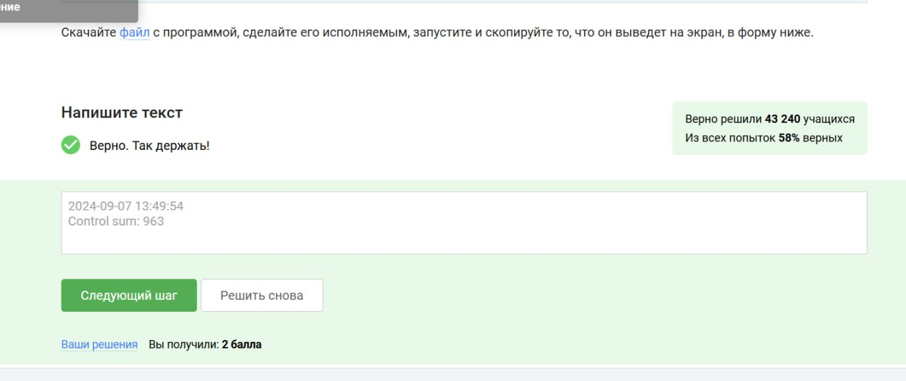
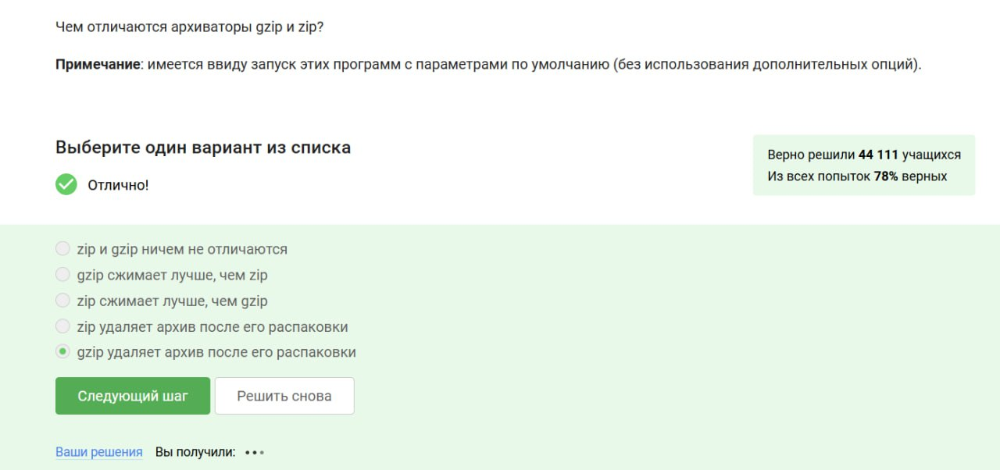

---
## Front matter
lang: ru-RU
title: Первый этап курса
author:
  - Абронина А. К.
institute:
  - Российский университет дружбы народов, Москва, Россия

## i18n babel
babel-lang: russian
babel-otherlangs: english

## Formatting pdf
toc: false
toc-title: Содержание
slide_level: 2
aspectratio: 169
section-titles: true
theme: metropolis
header-includes:
  - \metroset{progressbar=frametitle,sectionpage=progressbar,numbering=fraction}
  - '\makeatletter'
  - '\beamer@ignorenonframefalse'
  - '\makeatother'
  - \usepackage{fontspec}
  - \setmainfont{IBM Plex Sans}
  - \setsansfont{IBM Plex Sans}
  - \setmonofont{IBM Plex Sans}
---

# Информация

## Докладчик

## Докладчик

:::::::::::::: {.columns align=center}
::: {.column width="70%"}

  * Абронина Алиса Кирилловна
  * НКАбд-01-24, с/б 1132246717
  * Российский университет дружбы народов
  * <https://github.com/akabronina/study_2024-2025_os-intro>

:::
::: 
:::
::::::::::::::

# 1.1 Общая информация о курсе

Курс так и называется.

{#fig:001 width=70%}

---

Прочитав критерии прохождения курса, отметила необходимые варианты.

{#fig:002 width=70%}

# 1.2 Как установить Линукс

Я в большинстве случаев пользуюсь Линуксом, поэтому эту ОС и отметила

{#fig:003 width=70%}

---

На свой ноутбук я устанавливала специальную программу VirtualBox

{#fig:004 width=70%}

---

Да, виртуальная машина работает хорошо, так что с запуском Линукса не было проблем

{#fig:005 width=70%}

# 1.3 Осваиваем Линукс

Все делала по заданию

{#fig:006 width=70%}

---

deb - формат пакетов операционных систем проекта Debian. Используется также их производными, такими как Ubuntu, Knoppix и др.

{#fig:007 width=70%}

---

Все делала по заданию

{#fig:008 width=70%}

---

Менеджер обновлений - программа для обновления установленного программного обеспечения в дистрибутивах Линукс, основанных на Debian или использующих систему, усправления пакетами APT. Менеджер обновлений устанавливает обновления безопасности или просто улучшающие функциональность программы.

{#fig:009 width=70%}

# 1.4 Терминал. Основы

Ассоль - героиня литературного произведения, а термин - определение

{#fig:010 width=70%}

---

Интерфейс командной строки Линукс является регистрированным

{#fig:011 width=70%}

---

Опции -А и -almost all одинаковы, как и -h и -human-readable. Они в любом порядке эквивалентны

{#fig:012 width=70%}

---

Поднимаюсь на один уровень выше, а абсолютный путь всегда работает.

{#fig:013 width=70%}

---

rm -r используется для рекурсивного удаления директорий

{#fig:014 width=70%}

---

# 1.5 Запуск исполняемых файлов

Команда exit закроет и терминал и браузер

{#fig:015 width=70%}

---

Команда & запускает процесс в фоновом режиме, аналогично последовательно запуск контр + z(приостановка) bg (перевод в фон)

{#fig:016 width=70%}

---

Все сделала по заданию

{#fig:017 width=70%}

# 1.6 Ввод/Вывод

По умолчанию вывод ошибок выводится на экран

{#fig:018 width=70%}

---

Остальные команды неверны по синтаксису

{#fig:019 width=70%}

---

на экран

{#fig:020 width=70%}

# 1.7 Скачивание файлов из интернета

Команда представленная в задании скачивает файл и размещает его. После выполнения команды срабатывает часть ключа и только что скачанный файл конвертируется и резмещается в текущей директории.

{#fig:021 width=70%}

---

-q(quiet) отключает все сообщения, включая заголовки, прогресс, ошибки соединения

{#fig:022 width=70%}

---

Эта команда будет загружать только jpg

{#fig:023 width=70%}

# 1.8 Работа с архивами

По умолчанию gzip удаляет исходный файл после распаковки

{#fig:024 width=70%}

---

gzip  работает с отдельными файлами, не умеет архивировать директорию напрямую

{#fig:025 width=70%}

---

-с создать архив, -j использовать -f  имя файла

{#fig:026 width=70%}

---

# 1.9 Поиск файлов и слов в файлах

Имена и расширения чувствительны к регистру. Маска не подходит, потому что у файла расширение .jpeg

{#fig:027 width=70%}

---

регистр маленькая быква, слово world а не word  кавычки не воспринимаются

{#fig:028 width=70%}

---

все сделала по заданию

{#fig:029 width=70%}

